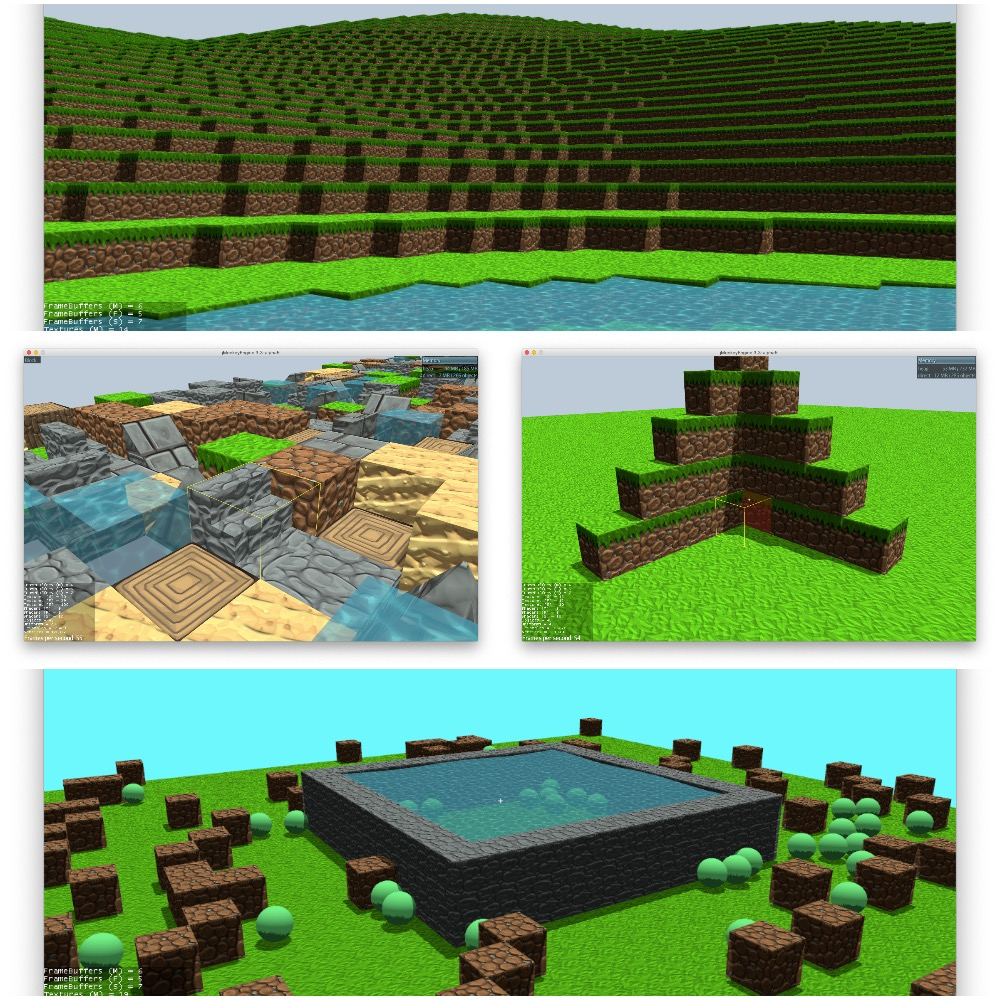

#  Blocks
Blocks is a voxel engine created for [jMonkeyEngine](https://jmonkeyengine.org).

 

## Features

### Multiple shapes

Next to the default cube shape, Blocks also supports more complicated shapes like pyramids, wedges, slabs, stairs, ...
This will make your creations feel even more vibrant!

### Theming support

Don't like the look and feel of the blocks? You can easily change the default textures by creating and using a different theme. 

### Endless terrain

Blocks comes with a fully fledged pager implementation that will load the blocks around the player, blocks that are out of sight will be unloaded to safe resources.

### Physics support

Add the generated collision meshes to the physics space of your application to create and simulate solid environments.

### Optimized for performance
 
Using multithreading, high demanding tasks like chunk generation and mesh creation can be run in parallel to maximize the CPU time.

### Designed for customization

Blocks is build with modularity and reuse in mind. If a part of the framework doesn't match your requirements you can easily swap it out and replace it with something else.

### Built using jMonkeyEngine best practices

The lifecycle of the Blocks framework is managed by AppState objects. This way the Blocks framework can easily and safely be plugged into the StateManager of jMonkeyEngine.

## Documentation
General documentation can be found on the [wiki](https://github.com/rvandoosselaer/Blocks/wiki). The javadoc of the latest stable version can be found at the [gh-pages.](https://rvandoosselaer.github.io/Blocks/1.4.2/javadoc/)
Documentation can only take you so far, so make sure to take a look at the different [examples](https://github.com/rvandoosselaer/Blocks/tree/master/examples/src/main/java/com/rvandoosselaer/blocks/examples).

## Contributing
If you have a bug or an idea, you can create a ticket for it [here.](https://github.com/rvandoosselaer/Blocks/issues)

## License
This project is licensed under the BSD 3-Clause License - see the [LICENSE](LICENSE) file for details

## Acknowledgements
-   Block textures made by [Soartex](https://soartex.net) from the Soartex Fanver.
-   Block textures made by [Faithful](https://www.curseforge.com/minecraft/texture-packs/faithful-32x).
-   jMonkeyEngine [forum](https://hub.jmonkeyengine.org/) community. Special thanks to ALi_RS, jayfella, sgold and pspeed for their contributions.
